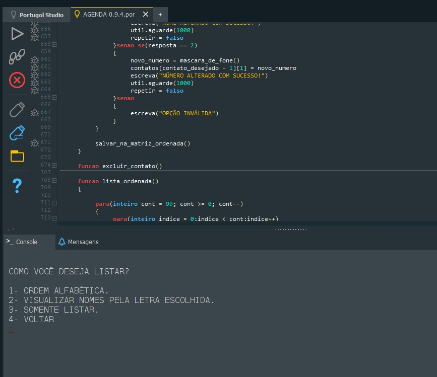
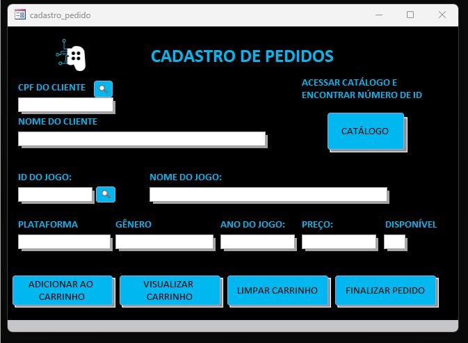

# 📜 Primeiros Projetos

🚀 Importante: Este repositório contém projetos antigos, desenvolvidos nos primeiros meses da minha jornada como programador. Estou compartilhando esses trabalhos para evidenciar minha evolução desde agosto de 2023 até o presente, mostrando como meus conhecimentos e habilidades cresceram ao longo do tempo.

🕰️ Sobre os Projetos
Aqui você encontrará dois sistemas que desenvolvi nos primeiros seis meses de estudo:

📞 Agenda Telefônica – Desenvolvida em Portugol, essa aplicação foi um dos meus primeiros contatos com lógica de programação e estruturação de dados.

🎮 404 Games – Sistema de controle para uma loja de jogos eletrônicos, criado com VBA e Microsoft Access, onde comecei a explorar conceitos de Banco de Dados e CRUD.

📝 Código Mantido Intacto
Esses projetos foram desenvolvidos nas respectivas datas e não sofreram alterações desde então. Eles refletem o nível de conhecimento que eu possuía na época, incluindo eventuais problemas de lógica, repetição de código e oportunidades de melhoria. No entanto, fazem parte da minha trajetória e mostram o quanto me dediquei e evoluí desde então.

👀 Por que compartilhar?
Publicá-los aqui é uma forma de documentar minha jornada e demonstrar minha evolução como desenvolvedor. Se comparados aos meus projetos mais recentes, fica evidente como o estudo contínuo e a prática me ajudaram a amadurecer minha lógica e minhas habilidades técnicas.

## #️⃣ Agenda Telefônica com Portugol 📞


### 📝 Sobre o projeto  
📅 Desenvolvido em Novembro/Dezembro de 2023
 
Durante a disciplina de Algoritmos e Lógica de Programação, tive meu primeiro grande desafio na programação: desenvolver, em equipe, uma Agenda Telefônica funcional utilizando Portugol. Como eu ainda estava nos primeiros passos com lógica de programação, esse projeto foi essencial para consolidar meu aprendizado.


### 🔨 Requisitos do Projeto
O sistema deveria permitir que o usuário:
- ✔ Criasse contatos e os armazenasse em um arquivo .txt
- ✔ Listasse os contatos por ordem alfabética, ordem de inserção ou pesquisa personalizada
- ✔ Atualizasse os dados do contato (nome e telefone)
- ✔ Excluísse contatos com base na pesquisa do usuário

### 🏗️ Desafios e Aprendizados  
Foi minha primeira experiência desenvolvendo um CRUD, o que exigiu bastante aprendizado e trabalho em equipe. Uma das minhas principais contribuições foi a implementação do algoritmo Bubble Sort para organizar os contatos em ordem alfabética.

Embora tenha sido um projeto simples e desenvolvido em uma linguagem voltada para aprendizado, ele foi fundamental para que eu aplicasse os conceitos de lógica de programação, manipulação de arquivos e estrutura de dados adquiridos ao longo do semestre. 

### 📂 Tecnologias Utilizadas  
- Portugol Studio

### 📷 Imagens


### 📦 Como executar o projeto  
1. Clone o repositório:  
   ```bash
   git clone https://github.com/seu-usuario/nome-do-repositorio.git

2. Acesse o código pelo Portugol Studio online:
    
    [Portugol Webstudio](https://portugol.dev/)
    
3. Execute o programa e carregue o arquivo "contatos.txt" contido na pasta do projeto


## #️⃣ 404 Games - Sistema de Controle de Loja de Jogos 🎮


### 📝 Sobre o projeto  
📅 Desenvolvido em Novembro/Dezembro de 2023
 
Durante a disciplina de Programação em Microinformática, tive como trabalho de encerramento da matéria a tarefa de desenvolver, em dupla, um sistema que implementasse um CRUD. O modelo de negócio atribuído ao nosso projeto foi o de uma loja de jogos eletrônicos, exigindo a criação de funcionalidades para gerenciar clientes, produtos e pedidos.


### 🔨 Requisitos do Projeto
O sistema deveria permitir que o usuário:
- ✔ Cadastro de Clientes, Jogos (Produtos) e Pedidos
- ✔ Geração de Relatórios, permitindo visualizar:
  - • Clientes cadastrados
  - • Jogos filtrados por gênero e plataforma, ou sem filtro (listando todos)
  - • Histórico de pedidos realizados
- ✔ Atualização de informações de Clientes e Jogos
- ✔ Exclusão de Clientes e Jogos


### 🏗️ Desafios e Aprendizados  
Esse foi o primeiro projeto em que precisei lidar simultaneamente com programação e banco de dados, o que me proporcionou um primeiro contato com conceitos essenciais que estudei mais a fundo posteriormente, como:
📌 Consultas SQL (queries para manipulação e recuperação de dados)

📌 Uso de classes como RecordSet (equivalente ao ResultSet do java.sql)

📌 Princípios de Orientação a Objetos aplicados na modelagem do sistema

Apesar de ser um projeto simples e desenvolvido com VBA e Access, foi um passo importante na minha jornada, pois me ajudou a consolidar conceitos fundamentais que seriam aprofundados nos estudos seguintes.

### 📂 Tecnologias Utilizadas  
- VBA (Visual Basic for Applications)
- Access

### 📷 Imagens


### 📦 Como executar o projeto  
1. Clone o repositório:  
   ```bash
   git clone https://github.com/seu-usuario/nome-do-repositorio.git
    
    
2. Execute o arquivo Access "404_games"


